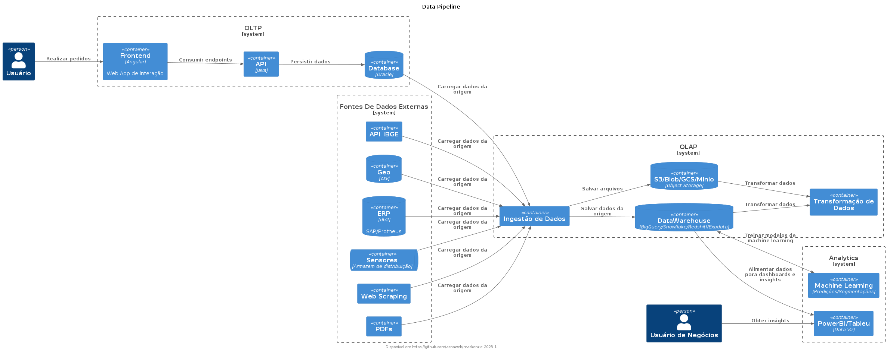

# Mackenzie


MBA em DevOps Engineering and Cloud Solutions

## Pessoas

###  [Apresentações](docs/apresentacao.md)

## DBRE (Database Reliability Engineer) e DataOps

### Conteúdo Programático

* DBRE e DataOps
* Gestão e Governança de Dados
* LGPD
* Arquitetura de Dados Relacionais
* Arquitetura NoSQL
* Soluções de Armazenamento de Dados na Nuvem
* Controle de versão em banco de dados com migrations

### Metodologia

- Contexto
- Perguntas/Dúvidas/Desafios
- Soluções
- Implementação da solução

## Conceitos

### Data Pipeline




- https://aws.amazon.com/pt/compare/the-difference-between-etl-and-elt/

### Eventos


- https://www.sensedia.com.br/post/o-que-e-mensageria-tudo-o-que-voce-precisa-saber

## Tools

### C4 Model


- https://c4model.com/

### Install PlantUML Ubuntu/Code Space

```sh
sudo apt update
sudo apt install -y graphviz
pip3 install pydot graphviz
```

>> **Visual Code**: instalar extensão PlantUML (jebbs)

#### Plantuml

- PlantUMl - https://www.plantuml.com/
- C4 Model com PlantUML - https://github.com/plantuml-stdlib/C4-PlantUML

```
@startuml
!include https://raw.githubusercontent.com/plantuml-stdlib/C4-PlantUML/master/C4_Container.puml

!define DEVICONS https://raw.githubusercontent.com/tupadr3/plantuml-icon-font-sprites/master/devicons
!define FONTAWESOME https://raw.githubusercontent.com/tupadr3/plantuml-icon-font-sprites/master/font-awesome-5
!include DEVICONS/angular.puml
!include DEVICONS/java.puml
!include DEVICONS/msql_server.puml
!include FONTAWESOME/users.puml

LAYOUT_WITH_LEGEND()

Person(user, "Customer", "People that need products", $sprite="users")
Container(spa, "SPA", "angular", "The main interface that the customer interacts with", $sprite="angular")
Container(api, "API", "java", "Handles all business logic", $sprite="java")
ContainerDb(db, "Database", "Microsoft SQL", "Holds product, order and invoice information", $sprite="msql_server")

Rel(user, spa, "Uses", "https")
Rel(spa, api, "Uses", "https")
Rel_R(api, db, "Reads/Writes")
@enduml
```

![](https://camo.githubusercontent.com/665fe705898c26a0718ee2d1dd5bf0bb735752d9c53cf552abaedf48da5ddcd1/68747470733a2f2f7777772e706c616e74756d6c2e636f6d2f706c616e74756d6c2f706e672f685039425a7a656d3443566c2d4848557230436842506a3373716b6249656b30546635754b317635465135394630354e5a667277396c3372456d7658442d663377673464455f45562d56797943746159586931725150437875743952517247647665652d663663306f2d46487941644551694147557956652d333774504c66505342356347416f6a6f5442486b793467586452704d4c653243474f39374b50493053505855416f59567441646950314644507679644f774d5979715f5742596b473855746871305a776732475a30354c6d4a33495a51566e37334c77654e6e51426852335f4d497064345f2d417759396d474e39627058755f7067724d7253666b36446a654d7477545f61786445356c4d61615f7838346d6446374e79617574514e6d786a4a45543352796a547a6c335668667a46696d63646f55425356792d494c51497535715f395a7765746757637a594d36646a6e4e77326b4259615f306f5935674c474d6c77766e396e33564e4a5a5f733661336c466462504f397967614542445158577a7357525a544e6a324c4b67414365756e353932747259706e6c434c55444832366b695a696b7732524b6e53356248375a754d65515f55456d756c61434a62696131544f6773507161345964685a6f526c73694e69686a5375772d6a4367695630613035585439675246375a6f31516c446272625a78517363736e575562307951576e415346466c694a4f766f355a774b6d43517842676f704173346351784a6a6c412d70735835496a367a2d464b63385567443856742d4d332d6a687879734a726d595171647234485661396450507a5f6d4730)


### IaC (Docker)

- https://github.com/acnaweb/iac

```
docker build -t devops .
docker run --name devops -it --rm -v ./infra:/shared devops /bin/bash
```

### Linux (notas)

```
sudo apt update
sudo apt upgrade

cd /etc/apt
ls -la
cat sources.lst

sudo apt list python* | grep install
which python3
sudo ln -s /usr/bin/python3 /usr/bin/python

# path atual
pwd 

whoami

cd ~

mkdir projects

- SSH
chave privada = /home/ac/.ssh/id_rsa
chave pública = /home/ac/.ssh/id_rsa.pub (compartilhar)
ssh-keygen -t rsa 


ls ~/.ssh -la
cat ~/.ssh/id_rsa
cat ~/.ssh/id_rsa.pub

export $(cat .env | xargs)
```

### Windows (notas)

```sh
$env:VAR1="Mackenzie"
$env:VAR1
Get-ChildItem env:
```

## Referencias

- [Data Ingestion/Airbyte: Site Oficial](https://airbyte.com/)
- [Data Ingestion/Airbyte: Install](https://github.com/acnaweb/airbyte)
- [Data Transformation/dbt Adapters: truested](https://docs.getdbt.com/docs/trusted-adapters)
- [Data Transformation/dbt Adapters: community](https://docs.getdbt.com/docs/community-adapters)
- [Data Transformation/SQL CTE](https://www.atlassian.com/data/sql/using-common-table-expressions)
- [Data Product: Data Contract](https://datacontract.com/)
- [Databases: Containers](https://github.com/acnaweb/database)
- [Test Container](https://testcontainers.com/)
- [Python: Install](https://www.python.org/downloads/)
- [Python: Repo template](https://github.com/acnaweb/python)
- [Pypi: repositório de artefatos Python](https://pypi.org/)
- [The 2024 MAD (ML, AI & Data) Landscape](https://mad.firstmark.com/)
- [Gitignore.io](https://www.toptal.com/developers/gitignore/)
- [Pre-commit](https://pre-commit.com/)
- [Makefile in Windows](https://medium.com/@samsorrahman/how-to-run-a-makefile-in-windows-b4d115d7c516)
- [Jinja: Template Engine](https://jinja.palletsprojects.com/en/3.1.x/)
- https://docs.getdbt.com/docs/build/custom-schemas
- https://www.databricks.com/glossary/medallion-architecture
- https://rivery.io/data-learning-center/types-of-etl-data-transformation/
- https://dataengineering.wiki/Index
- https://learn.microsoft.com/pt-br/power-bi/guidance/star-schema
- https://www.kimballgroup.com/data-warehouse-business-intelligence-resources/books/data-warehouse-dw-toolkit/
- https://realpython.com/


